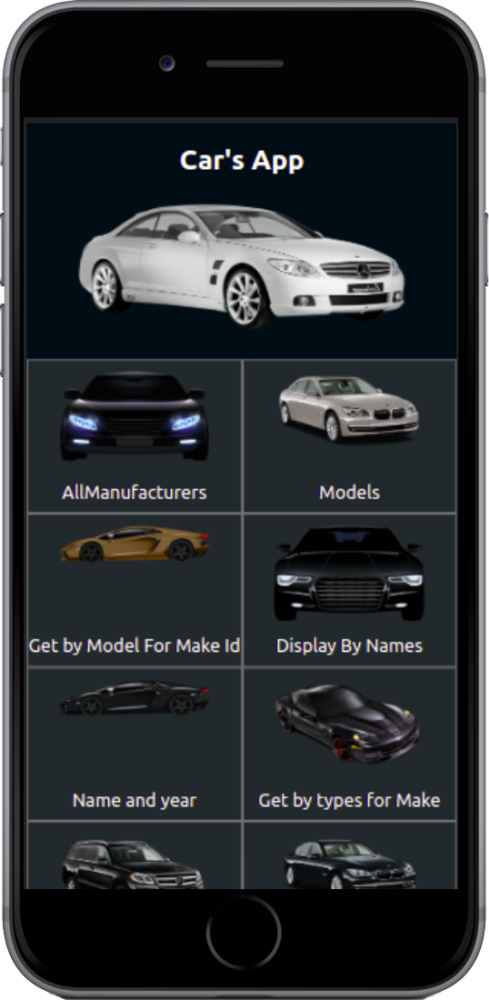
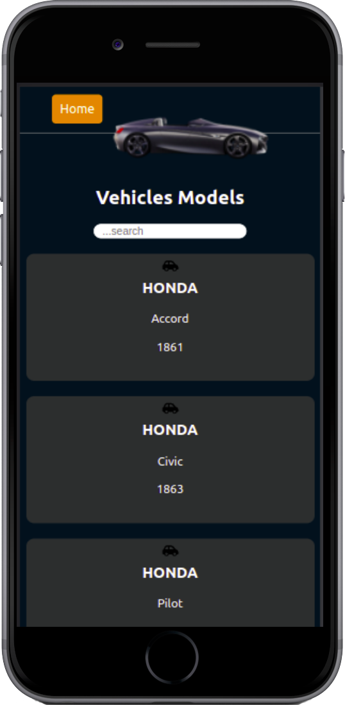

# Vehicles App

    
    
    

## Built With

- React
- Redux

## Getting Started

To get a local copy up and running follow these simple example steps.

- copy this link `https://github.com/camilevahviraki/Vehicles-recipe`.
- get the directory that you want to clone the repository.
- open the command prompt in this directory.
- write `https://github.com/camilevahviraki/Vehicles-recipe`.
- go to the repository folder in your command prompt `Vehicles-recipe`.
- Open terminal in that folder and run `npm run start`.

## Live link

See the [live demo](https://vehicles-cathalogue.netlify.app) of my Car's App.

or [view the video of explaning the project](https://www.loom.com/share/7f44f6fdad8d4324884d7f2aeb1fa4a6)

 ## 👤 Author

- GitHub: [@camilevahviraki](https://github.com/camilevahviraki)
- Twitter: [@camilevahviraki](https://twitter.com/CamileVahviraki)
- LinkedIn: [camilevahviraki](https://www.linkedin.com/in/camile-vahviraki-8180a6232/)

## 🤝 Contributing

Contributions, issues, and feature requests are welcome!

Feel free to check the [issues page](../../issues/).

## Show your support

Give a ⭐️ if you like this project!

## Acknowledgments

- Inspiration: Microverse
- [Nelson Sakwa](https://www.behance.net/sakwadesignstudio)
- etc